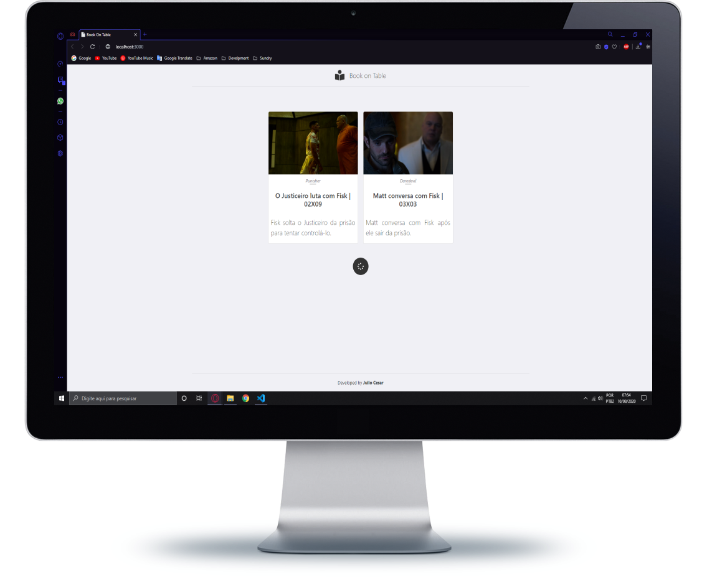
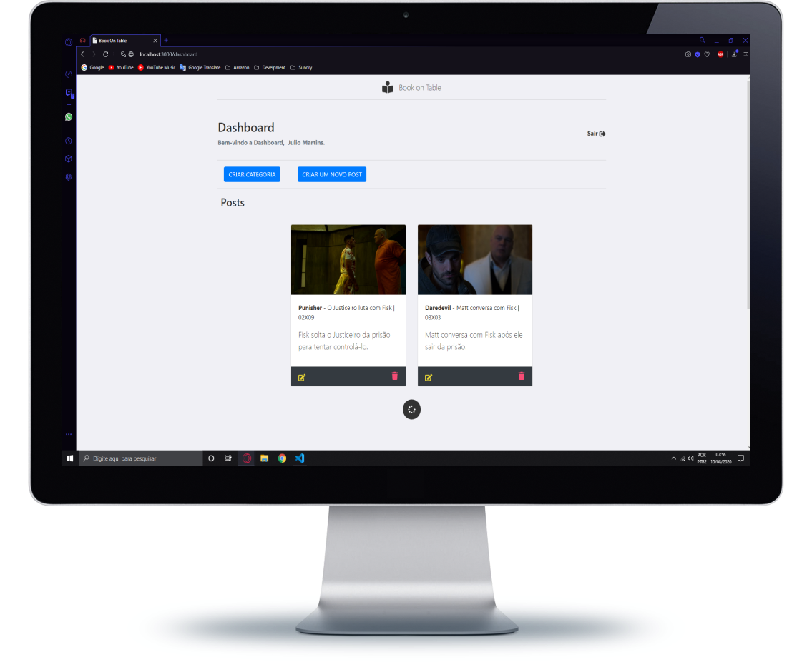
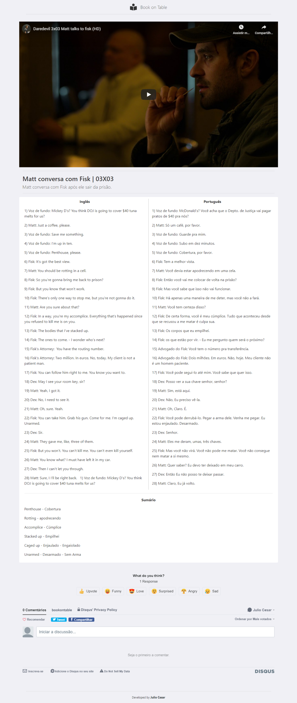

# Book On Table   

## O foco desse projeto é prover uma plataforma de artigos em inglês esses artigos seriam pequenos trechos de séries e filmes para pessoas que desejam estudar inglês tenham esse material de forma mais fácil.

### techs:
<strong>Backend: Node.js, Mongo DB</strong>
<strong>Front-end: ReactJS, Bootstrap</strong>

### features:
<strong>Autenticação, CRUD, Paginação</strong>

## Home

## Dashboard

## Conteúdo

